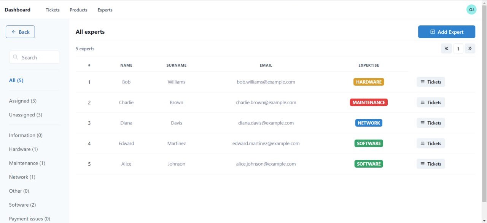
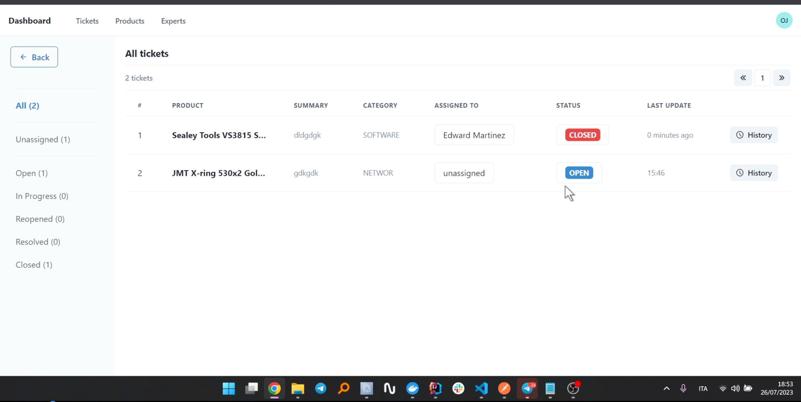
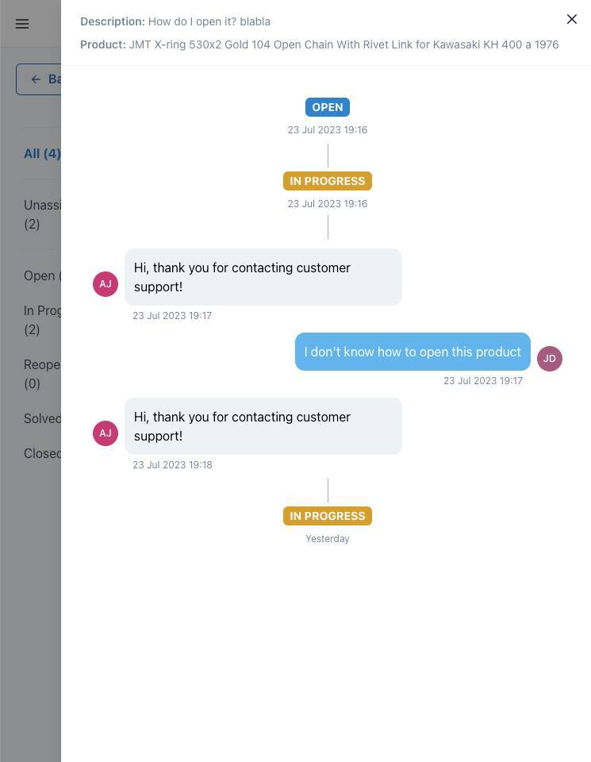

# TicketSupport

Help desk platform to manage company’s purchased product, warranties, and customer’s support tickets.

<div style="display: flex; flex-wrap: wrap;">
    
    
     
</div>

# Project Structure

The project comprises a backend API written in Kotlin (Spring Boot), a PostgreSQL database, a monitoring system based on Grafana, and a full frontend written in JavaScript (ReactJS).
All packed into several different docker containers.

```
src
├── server
│   ├── Makefile
│   ├── docker
│   └── src
└── client
    ├── Makefile
    └── src
```

# Contributors

- [Mario Testa](https://github.com/mariotesta-dev/)
- [Mattia Mazzari](https://github.com/mattiamazzari/)
- [Lorenzo Gangemi](https://github.com/GangemiLorenzo/)
